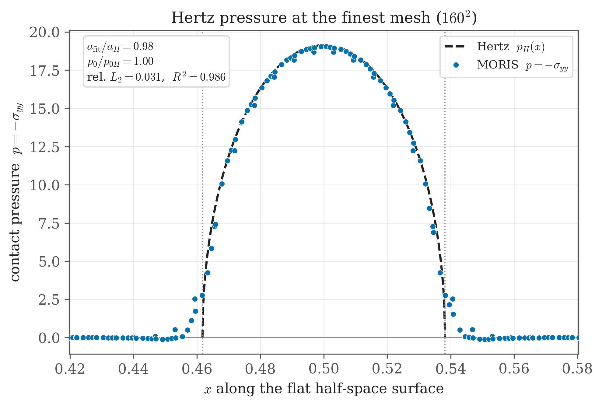
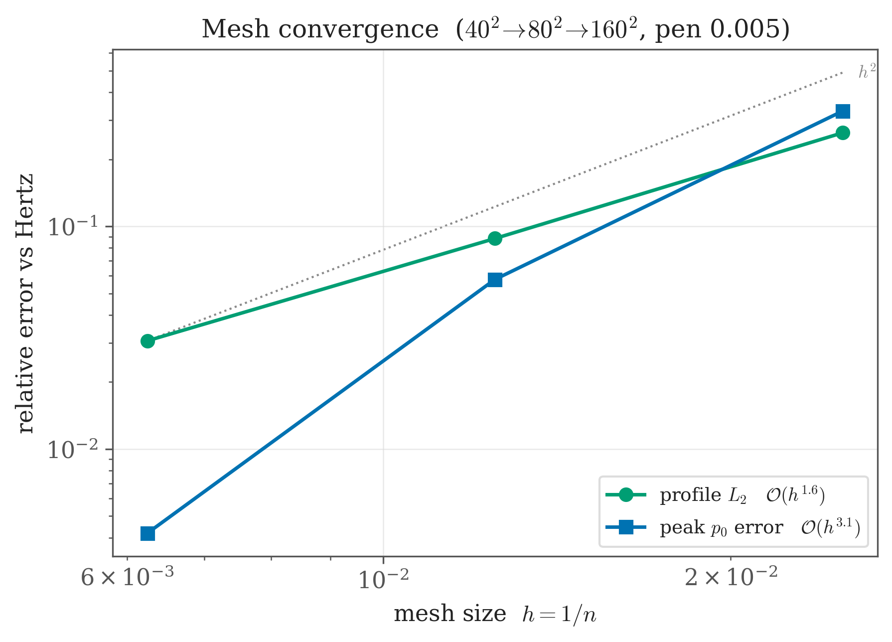
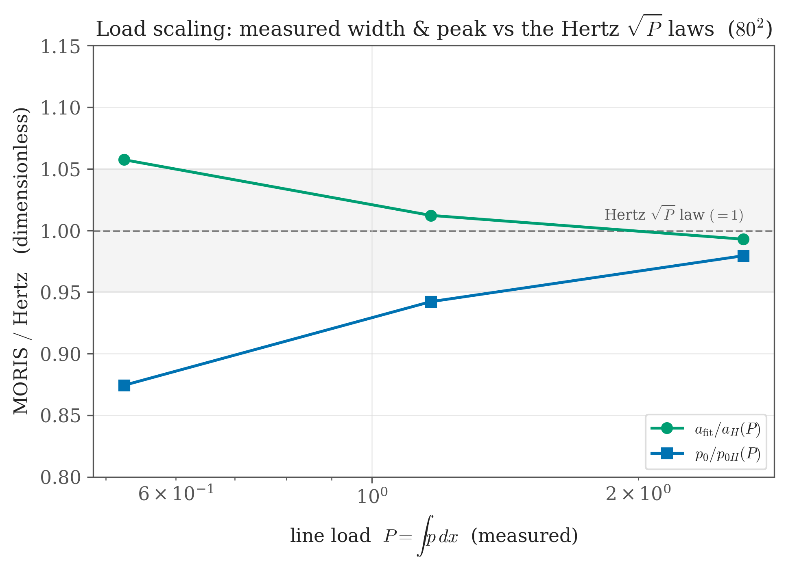

# Verification: Struc_Hertz_Contact — immersed Nitsche pressure vs the Hertz closed form

Verification record for the Hertzian-contact example. Where the patch test proves the
immersed Nitsche contact operator transmits a *constant* stress across a non-conforming
interface, this benchmark asks whether the same operator reproduces a *non-constant,
analytically known* field — the semi-elliptic Hertz pressure, its peak p₀, and its contact
half-width a — with the error converging under mesh refinement.

## Setup and closed form

2D plane; a parabolic indenter of local radius R = 0.5 pressed displacement-controlled into
a flat linear-elastic half-space; both bodies E = 1000, ν = 0 (so E* = E/2 = 500, and the
plane-stress/plane-strain convention is moot). Contact enforced by the neutral θ = 0
unbiased Nitsche operator (`STRUC_LINEAR_CONTACT_NORMAL_NEUTRAL_NITSCHE_UNBIASED`) on a
`NONCONFORMAL_SIDESET`, ghost on. The line load P is *measured* from the recovered profile
(P = ∫p dx), then Hertz line-contact (Johnson §4.2) gives

a_H = 2√(PR/(πE*)),  p₀H = √(PE*/(πR)),  p_H(x) = p₀H √(1 − ((x−x_c)/a_H)²).

Measured regime: a/R = 0.055–0.115 across all cases — inside the small-patch validity bound
(a/R ≲ 0.15), demonstrated rather than assumed. Pressure is read as p = −σ_yy on the flat
bottom body (its contact normal is vertical, so σ_nn = σ_yy exactly, no projection).

## Results

**Profile at the finest mesh (160², pen 0.005):** a_fit/a_H = 0.98, p₀/p₀H = 1.00,
rel. L₂ = 0.031, R² = 0.986 over the Hertz support.

**Mesh convergence (40² → 80² → 160², pen 0.005):** profile L₂ error O(h^1.6), peak-p₀
error O(h^3.1) — both at or above the h² reference.

**Load scaling (80², pen 0.0025/0.005/0.01):** measured a_fit/a_H(P) and p₀/p₀H(P) approach
1 with load, following the Hertz √P laws; the coarsest-load case (a ≈ 2 cells) is
resolution-limited, consistent with the convergence panel.

| case | mesh | pen | a_fit/a_H | p₀/p₀H | a/R | rel-L₂ | R² |
|---|---|---|--:|--:|--:|--:|--:|
| 1 | 80² | 0.0025 | 1.057 | 0.874 | 0.055 | 0.124 | 0.766 |
| 3 | 40² | 0.005 | 1.399 | 0.671 | 0.108 | 0.263 | −2.03 |
| 4 | 80² | 0.005 | 1.012 | 0.942 | 0.078 | 0.088 | 0.913 |
| 5 | 160² | 0.005 | 0.981 | 0.996 | 0.075 | 0.031 | 0.986 |
| 7 | 80² | 0.01 | 0.993 | 0.979 | 0.115 | 0.048 | 0.971 |

The 40² case is honestly bad (contact patch under-resolved at ~2 cells across a) and is the
anchor of the convergence claim, not an embarrassment to hide.

## Relation to the ctest gates

The registered ctests are structural/finiteness gates (the strict nodal regression is
gated off on the FULL_DISCONTINUOUS mesh — see the example_test_case header). The
quantitative verification above is this record: the same deck, harvested in post from the
per-case Exodus output.

## Provenance

Study: `runs/studies/hertz_contact/` in the workspace (section.md, results.json with full
profiles, harvest.py / hertz_extract.py / plots_v2.py, 2026-07). Case indices there map to
this example's (penetration × mesh) matrix; figures reproduced here verbatim.
