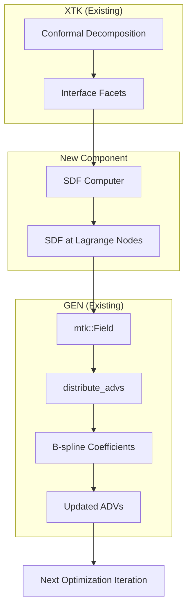

# SDF Reinitialization Implementation Plan (Revised)

## Selected Approach: Interface-Based SDF Computation

**Decision**: Use XTK's triangulated interface geometry to compute exact signed distances, rather than solving a PDE.

**Rationale**:
- XTK already constructs the interface during decomposition
- Geometric distance computation is exact (no discretization error)
- No interface drift (uses actual geometry)
- Leverages existing `GEN::distribute_advs()` for B-spline projection
- Estimated effort: **3-5 days** (vs 8-11 for PDE approach)

---

## Success Criteria

### Level 1: Technical Correctness

| Criterion                  | Metric                        | Test                                          |
| -------------------------- | ----------------------------- | --------------------------------------------- |
| **Exact SDF values**       | $\|\nabla\phi\| = 1 \pm 0.05$ | Gradient magnitude at mesh nodes after reinit |
| **Sign preservation**      | Material < 0, void > 0        | Check consistency with bulk phase             |
| **Interface preservation** | Zero level-set unchanged      | Compare interface position before/after       |
| **Analytic validation**    | Error < 1%                    | Circle test: $\phi = \|x - c\| - r$           |

### Level 2: Integration Success

| Criterion                  | Evidence                                           |
| -------------------------- | -------------------------------------------------- |
| **ADV update works**       | `get_advs()` returns different values after reinit |
| **Optimization continues** | No crash, objective evolves normally               |
| **Parallel execution**     | Same results on 1 vs 4 procs (within tolerance)    |
| **C++ codegen**            | PyMORIS generates correct parameter lists          |

### Level 3: User-Facing Impact (Primary Goal)

| Criterion                         | Verification                                |
| --------------------------------- | ------------------------------------------- |
| **Floating artifacts eliminated** | Visual inspection of `design_evolution.gif` |
| **Clean final topology**          | No isolated material islands                |
| **Smooth optimization**           | Objective without spurious jumps            |
| **Simple API**                    | Single `.reinitialize_sdf_every(20)` call   |

### Definition of Done

> **The feature is complete when:** Running `levelset_boxbeam_multilinear.py` with `.reinitialize_sdf_every(20)` produces a design evolution **without floating artifacts**, resulting in a clean, fully-connected truss-like structure.

---

## Architecture Overview



---

## Phase 1: SDF Computer from Interface (Days 1-2)

### 1.1 Create `SDF_From_Interface` Class

**File**: `moris/projects/GEN/SDF/src/cl_SDF_From_Interface.hpp`

```cpp
#pragma once
#include "cl_Matrix.hpp"
#include "cl_MTK_Mesh.hpp"

namespace moris::sdf
{
    class SDF_From_Interface
    {
    public:
        /**
         * Compute SDF from interface facets
         * @param aMesh       Interpolation mesh (Lagrange nodes)
         * @param aFacetNodes Node coordinates of interface facets
         * @param aFacetConn  Connectivity of facets (node indices per facet)
         * @param aBulkPhase  Bulk phase index per node (for sign)
         * @param aMaterialPhase Which phase is "inside" (negative SDF)
         * @param aSDF        Output: SDF values at mesh nodes
         */
        static void compute(
            mtk::Mesh*                    aMesh,
            const Matrix<DDRMat>&         aFacetNodes,
            const Matrix<IndexMat>&       aFacetConn,
            const Vector<moris_index>&    aBulkPhase,
            moris_index                   aMaterialPhase,
            Matrix<DDRMat>&               aSDF);
    };
}
```

### 1.2 Implement Distance Computation

**File**: `moris/projects/GEN/SDF/src/cl_SDF_From_Interface.cpp`

Key functions:
- `point_to_triangle_distance()` - 3D distance from point to triangle
- `point_to_edge_distance()` - 2D distance from point to line segment  
- `determine_sign()` - Sign from bulk phase assignment

```cpp
void SDF_From_Interface::compute(...)
{
    uint tNumNodes = aMesh->get_num_nodes();
    aSDF.set_size(tNumNodes, 1);
    
    // For each mesh node
    for (uint iNode = 0; iNode < tNumNodes; ++iNode)
    {
        Matrix<DDRMat> tCoords = aMesh->get_mtk_vertex(iNode).get_coords();
        
        // Find minimum distance to any facet
        real tMinDist = MORIS_REAL_MAX;
        for (uint iFacet = 0; iFacet < aFacetConn.n_rows(); ++iFacet)
        {
            real tDist = point_to_facet_distance(tCoords, aFacetNodes, aFacetConn, iFacet);
            tMinDist = std::min(tMinDist, tDist);
        }
        
        // Determine sign: material phase = negative, void = positive
        real tSign = (aBulkPhase(iNode) == aMaterialPhase) ? -1.0 : 1.0;
        
        aSDF(iNode) = tSign * tMinDist;
    }
}
```

### 1.3 Optimize with Bounding Box / Spatial Tree (Optional)

For large meshes, use bounding box culling or k-d tree for O(N log F) instead of O(N × F).

---

## Phase 2: Integration with Reinitialize_Performer (Day 2-3)

### 2.1 Add Interface-Based Mode to Reinitialize_Performer

**File**: `moris/projects/WRK/src/cl_WRK_Reinitialize_Performer.hpp`

```cpp
enum class ReinitMode {
    FIELD_REMAP,        // Current: remap solution field
    INTERFACE_SDF       // New: compute exact SDF from interface
};

class Reinitialize_Performer {
    ReinitMode mReinitMode = ReinitMode::FIELD_REMAP;
    moris_index mMaterialPhase = 0;  // Which phase is "inside"
    
public:
    void set_reinit_mode(ReinitMode aMode);
    void set_material_phase(moris_index aPhase);
    
    // New method
    void compute_sdf_from_interface(
        xtk::Cut_Integration_Mesh& aCutMesh,
        mtk::Mesh* aInterpMesh,
        std::shared_ptr<mtk::Field>& aSDFField);
};
```

### 2.2 Implement Interface SDF Computation

**File**: `moris/projects/WRK/src/cl_WRK_Reinitialize_Performer.cpp`

```cpp
void Reinitialize_Performer::compute_sdf_from_interface(
    xtk::Cut_Integration_Mesh& aCutMesh,
    mtk::Mesh* aInterpMesh,
    std::shared_ptr<mtk::Field>& aSDFField)
{
    // 1. Get interface facets from XTK
    Vector<moris_index> const& tInterfaceFacetIndices = aCutMesh.get_interface_facets();
    
    // 2. Extract facet geometry (nodes + connectivity)
    Matrix<DDRMat> tFacetNodes;
    Matrix<IndexMat> tFacetConn;
    extract_facet_geometry(aCutMesh, tInterfaceFacetIndices, tFacetNodes, tFacetConn);
    
    // 3. Get bulk phase per node
    Vector<moris_index> tBulkPhase(aInterpMesh->get_num_nodes());
    for (uint i = 0; i < tBulkPhase.size(); ++i) {
        tBulkPhase(i) = determine_node_bulk_phase(aCutMesh, i);
    }
    
    // 4. Compute SDF
    Matrix<DDRMat> tSDF;
    sdf::SDF_From_Interface::compute(
        aInterpMesh, tFacetNodes, tFacetConn, 
        tBulkPhase, mMaterialPhase, tSDF);
    
    // 5. Create MTK Field
    aSDFField = std::make_shared<mtk::Field_Discrete>(/* mesh pair */, mAdofMeshIndex);
    aSDFField->set_label(mADVFieldName);
    aSDFField->set_values(tSDF);
}
```

### 2.3 Update Workflow Integration

**File**: `moris/projects/WRK/src/cl_WRK_Workflow_HMR_XTK.cpp`

Modify the reinitialization call (around line 228-248):

```cpp
if (mReinitializePerformer->get_reinit_mode() == ReinitMode::INTERFACE_SDF)
{
    // New: Compute SDF from XTK interface
    std::shared_ptr<mtk::Field> tSDFField;
    mReinitializePerformer->compute_sdf_from_interface(
        *tCutMesh,            // XTK mesh with interface
        tInterpMesh,          // Lagrange mesh
        tSDFField);
    
    // Use existing mechanism to update ADVs
    mGENPerformer->distribute_advs(tMeshPair, {tSDFField});
    aNewADVs = mGENPerformer->get_advs();
}
```

---

## Phase 3: Parameter Lists and Fluent API (Day 3-4)

### 3.1 Add Parameters

**File**: `moris/projects/PRM/src/fn_PRM_OPT_Parameters.hpp`

```cpp
tParameterList.insert("sdf_reinit_mode", "none");  // "none", "field_remap", "interface"
tParameterList.insert("sdf_reinit_material_phase", 0);
```

### 3.2 PyMORIS Fluent API

**File**: `pymoris/fluent/builders.py`

```python
def reinitialize_sdf_every(
    self,
    n_iterations: int,
    *,
    first_at: Optional[int] = None,
    mode: str = "interface",  # "interface" or "field_remap"
    material_phase: int = 0,
) -> "OptimizationBuilder":
    """Enable SDF reinitialization from interface geometry.
    
    Periodically recomputes exact signed distances from XTK's
    interface facets to eliminate floating artifacts.
    
    Args:
        n_iterations: Reinitialize every N iterations
        first_at: Iteration for first reinitialization
        mode: "interface" (exact) or "field_remap" (legacy)
        material_phase: Bulk phase index for "inside" (negative SDF)
    """
    opt = self._opt.optimization_problems[0]
    opt.reinitialize_interface_iter = n_iterations
    if first_at is not None:
        opt.first_reinitialize_interface_iter = first_at
    opt.sdf_reinit_mode = mode
    opt.sdf_reinit_material_phase = material_phase
    return self
```

---

## Phase 4: Testing (Day 4-5)

### 4.1 Unit Test: Distance Computation

**File**: `moris/projects/GEN/SDF/test/ut_SDF_From_Interface.cpp`

- Test point-to-triangle distance (known geometry)
- Test point-to-edge distance (2D)
- Verify sign determination

### 4.2 Integration Test: Circle SDF

- Create circular interface via level-set
- Run XTK decomposition
- Compute SDF from interface
- Verify values match analytic: |x - center| - radius

### 4.3 Regression Test: Boxbeam

- Run `levelset_boxbeam_multilinear.py` with `reinitialize_sdf_every(20)`
- Compare `design_evolution.gif` with/without reinit
- Quantify artifact reduction

---

## Files to Create/Modify

| File                                        | Action     | Description             |
| ------------------------------------------- | ---------- | ----------------------- |
| `GEN/SDF/src/cl_SDF_From_Interface.hpp`     | **CREATE** | SDF computer class      |
| `GEN/SDF/src/cl_SDF_From_Interface.cpp`     | **CREATE** | Distance computation    |
| `WRK/src/cl_WRK_Reinitialize_Performer.hpp` | MODIFY     | Add interface mode      |
| `WRK/src/cl_WRK_Reinitialize_Performer.cpp` | MODIFY     | Implement interface SDF |
| `WRK/src/cl_WRK_Workflow_HMR_XTK.cpp`       | MODIFY     | Call new method         |
| `PRM/src/fn_PRM_OPT_Parameters.hpp`         | MODIFY     | Add parameters          |
| `pymoris/blocks/opt.py`                     | MODIFY     | Add Python fields       |
| `pymoris/fluent/builders.py`                | MODIFY     | Add fluent method       |

---

## Estimated Effort

| Phase     | Task                               | Effort     |
| --------- | ---------------------------------- | ---------- |
| 1         | SDF_From_Interface implementation  | 1.5 days   |
| 2         | Reinitialize_Performer integration | 1 day      |
| 3         | Parameters + Fluent API            | 0.5 day    |
| 4         | Testing                            | 1 day      |
| **Total** |                                    | **4 days** |

---

## Comparison: Original vs Revised Approach

| Aspect              | PDE-Based (Original) | Interface-Based (Revised) |
| ------------------- | -------------------- | ------------------------- |
| Algorithm           | Sussman-Sethian PDE  | Point-to-facet distance   |
| Accuracy            | Approximate          | **Exact**                 |
| Interface drift     | Possible             | **None**                  |
| Effort              | 8-11 days            | **3-5 days**              |
| New FEM code        | Yes (IWG)            | No                        |
| Parallel complexity | Medium               | Low                       |

---

## Ready to Start

Begin with **Phase 1.1: Create SDF_From_Interface header**.

Key reference files:
- `cl_SDF_Triangle.cpp` - Existing distance computation
- `cl_XTK_Cut_Integration_Mesh.cpp` - Interface facet access
- `cl_WRK_Reinitialize_Performer.cpp` - Integration point
